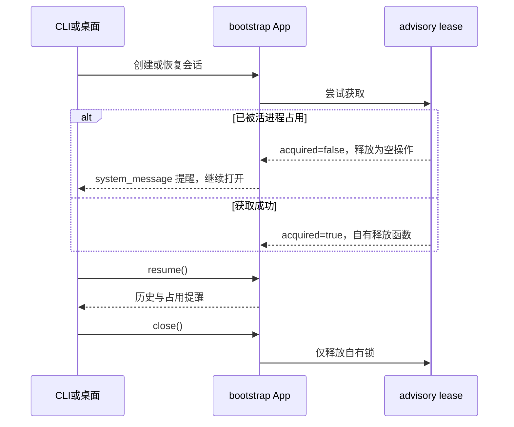

# CLI 与桌面共享会话恢复

- `--resume` 和 `--continue` 启动 TUI 时，在同一 App 上执行恢复并加载历史，将恢复结果作为 initialResult 展示；恢复失败向上传播，不静默显示空欢迎页。普通新会话仍显示欢迎页，不调用恢复。不需要可执行模型即可读取恢复历史。
- 管理页恢复命令按平台 shell 引用参数，Windows 使用 PowerShell 单引号（内部单引号加倍），其他平台使用 POSIX 单引号引用；不使用 JSON 转义生成命令，Windows 路径保留原反斜杠。
- CLI prompt handler 是当前 App 的唯一所有者；目标会话 ID 通过现有 `resolveResumeSession` 解析。
- 目标等于当前 `sessionId` 时复用 App，通过原有 `app.resume()` 与 transcript 加载路径返回恢复结果。
- 目标不同时先创建目标 App，成功后关闭旧 App；真实创建失败仍保留当前 App。
- writer lease 是占用提示：其他活 CLI/桌面持有同一数据库、同一会话时，创建与恢复继续，不抛 busy、不确认、不删除或释放其他持有者的锁。其他文件系统错误仍向上传播。
- adapter 保留可调用的异步释放函数，并提供 `acquired` 状态；未取得锁时释放为空操作。App 关闭或创建失败只释放自己取得的锁。
- bootstrap 通过现有 `system_message`（`init`）事件展示简短提醒；恢复完成后再次发出，使恢复订阅者可见。CLI 恢复响应同时附上提醒。提醒不进入模型上下文，不调用模型。
- 未取得 lease 的 App 跳过启动时的工作流孤儿收敛，因为其他活进程的非终态工作流不是孤儿。各 App 只关闭自己拥有的工作流。
- 不修改数据库结构或磁盘锁协议，不扩展跨进程消息、队列、状态的完整实时同步。普通 SQLite 消息按 ID 写入；恢复已有会话不重新创建会话行。并发业务操作仍遵循既有存储语义。

验收：显式恢复当前会话与继续当前会话复用 App；切换会话成功后关闭旧 App；真实临时共享 SQLite 同会话两个 App 同时打开并正常恢复，冲突提醒可见，close/创建失败不影响原持有者；其他 I/O 故障正常传播。测试使用临时数据库和虚构数据，禁止真实模型请求或用户数据库修改。
